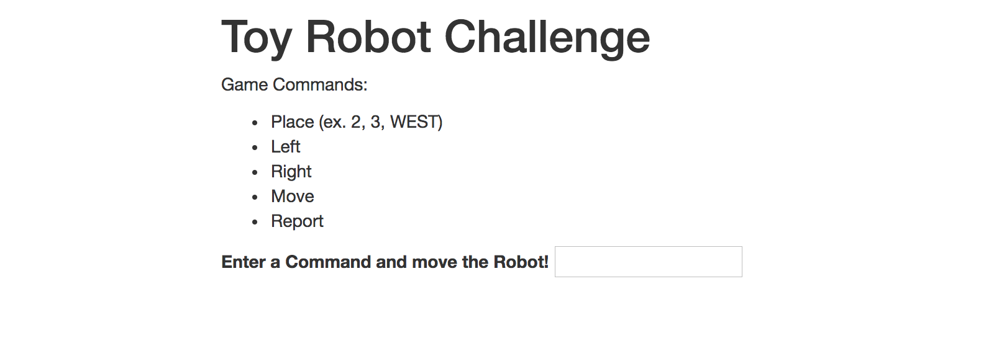
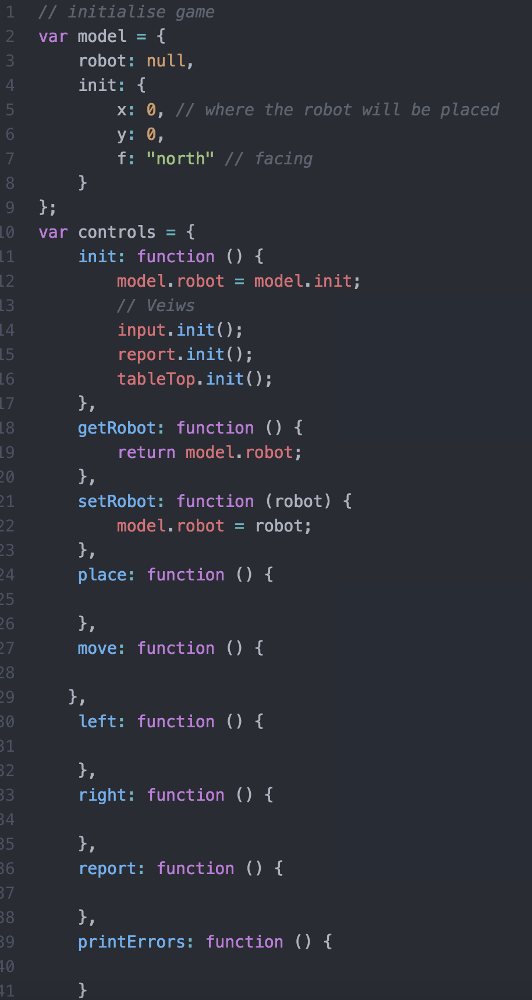
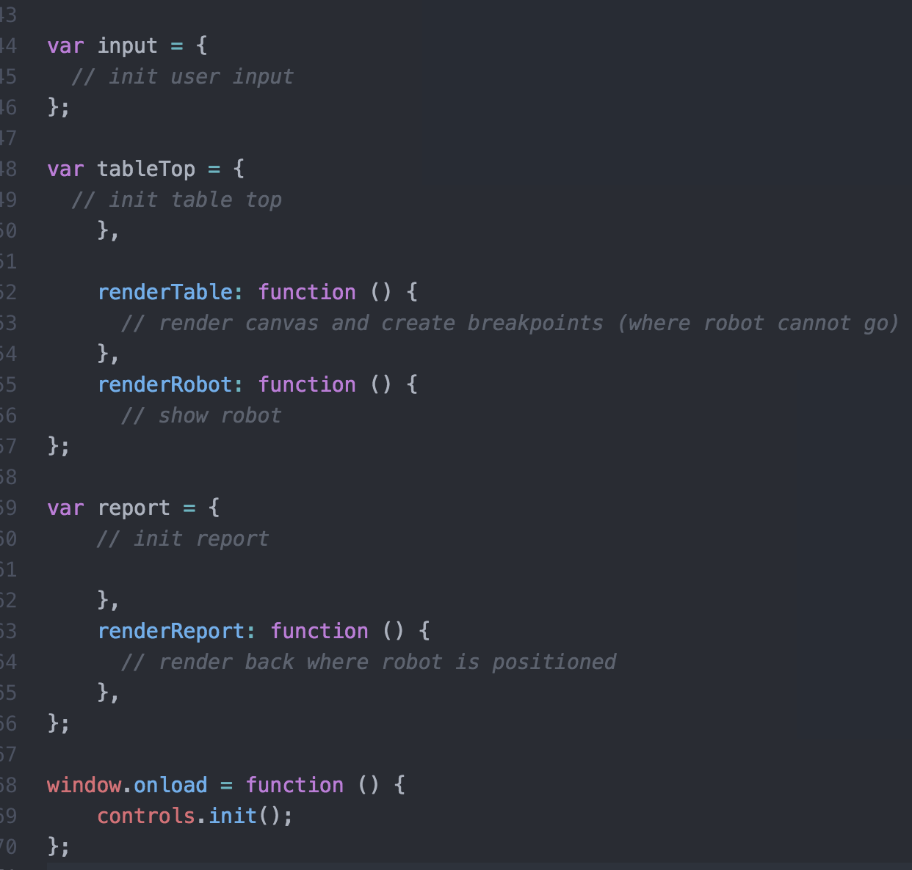

# __Toy Robot Challenge__
*This Challenge is a Technical Test*

### Objectives
- The application is a simulation of a toy robot moving on a square tabletop, of dimensions 5 units x 5 units
- There are no other obstructions on the table surface
- The robot is free to roam around the surface of the table, but must be prevented from falling to destruction. Any movement that would result in the robot falling from the table must be prevented, however further valid movement commands must still be allowed

### Requirements
*Create an application using JavaScript that can handle the following commands:
PLACE X,Y,F
MOVE
LEFT
RIGHT
REPORT*

-  __PLACE__ will put the toy robot on the table in position X,Y and facing __NORTH__, __SOUTH__, __EAST__ or __WEST__
-  The origin (0,0) can be considered to be the __SOUTH WEST__ most corner
-  The first valid command to the robot is a __PLACE__ command, after that, any sequence of commands may be issued, in any order, including another PLACE command. The application should discard all commands in the sequence until a valid PLACE command has been executed

-  __MOVE__ will move the toy robot one unit forward in the direction it is currently facing
-  __LEFT__ and __RIGHT__ will rotate the robot 90 degrees in the specified direction without changing the position of the robot
-  __REPORT__ will announce the __X__,__Y__ and __F__ of the robot. This can be in any form, but standard output is sufficient. This can be invoked manually or can be triggered by invoking any of the commands above
-  A robot that is not on the table can choose to ignore the __MOVE__, __LEFT__, __RIGHT__ and __REPORT__ commands
-  Input can be from a standard input or as the developer chooses
-  Provide test data to exercise the application

### Example Output
__Example a__

>PLACE 0, 0, NORTH

>MOVE

>__REPORT__

Expected output

*0, 1, NORTH*

__Example b__

>PLACE 0, 0, NORTH

>LEFT

>__REPORT__

Expected output

*0, 0, WEST*

__Example c__

>PLACE 1, 2, EAST

>MOVE

>MOVE

>LEFT

>MOVE

>__REPORT__

Expected output

*3, 3, NORTH*

### Constraints
>The toy robot must not fall off the table during movement. This also includes the initial placement of the toy robot.
Any move that would cause the robot to fall must be ignored.

## Plan
> Set-up basic html structure

> Add in Bootstrap for a nice look, feel

> initialise js and begin basic js functions

> See the application come together!

### Basic HTML Structure

*I firstly set up a template to use for my robot game, and added in bootstrap. I added in a list of commands that will let the user understand how to move the robot. I also included an input field which allows the user to move it.*

### Beginning JS Functions

 

Before putting the 'basic' functions that I think would be needed so far for the completion of the task, I wrote down on paper what I would need, as per requirements

   - Initialise the game,
   - Add the functions; place, left, right, move & report,
   - Print errors such as; 'Exceeding table limit'
   - Create the variables; input, axisTable, report

  I decided to go straight to paper first, other than coding to just jot down what I feel would be needed. I then decided what was most needed and took away what I thought would be a 'nice' feature. I did this to minimise time wasted staring at a computer screen wondering what to type.

### Adding Code

Admittedly I took my time to do this, and though at some stages I felt quite stuck I decided to refer to some docs and tutorials for basic command games for some insight and refresh on Javascript. I added some logic that I thought would help me further my progress in completing the brief. I initialised the x, y and f which was equal to north and I moved on to code simple things such as; 'document.getElementById', restricting input values & creating an error handler.
As I read further into docs about such controlling behaviour by the user this application would have, I found that sometimes you need to specify in the coding conventions the direction, eg. anticlockwise or clockwise.
After some deep research in how to create the axis, I found I needed to restrict the max of X & Y in accordance to the brief. Since I had already initialised the X & Y, I was ready to make constraints to them, simply using __this.max__ according to some documentation I read, will easily do the trick. I 'init[ed]' this within the axisTable along with the size of the robot.
I also began to create the 'report' variable that uses the reportMessage to send the data to output with the innerHTML line of code.

I'm still very much in the early stages of production with this brief, and haven't gotten to the stage of rendering the 'robot game' on the page. My next step before coding any further will be to test my code properly to discover whether how I'm going is correct. And though I will not be finished by Monday (tomorrow), I wish to continue with this brief, not only for the possibility of recognition, but to challenge myself and learn more as I would like to know general JS in more depth.

I would like to eventually, once I have this working as required, to instead of having the movements of the robot done by user input, have it controlled by keyboard arrows. I did do some research into this and discovered that the arrows have keycodes, and hoping to successfully use them in a function.

While this has been quite a challenge for me, involving lots of reading, and while I haven't 'completed' it, its still been an informative learning experience. I've never used axis within code before, or the movement of an object by any means, though it's great to know what I (hopefully) will be able to achieve with more practice and challenges!

Lookout for updates as I plan to complete this!
